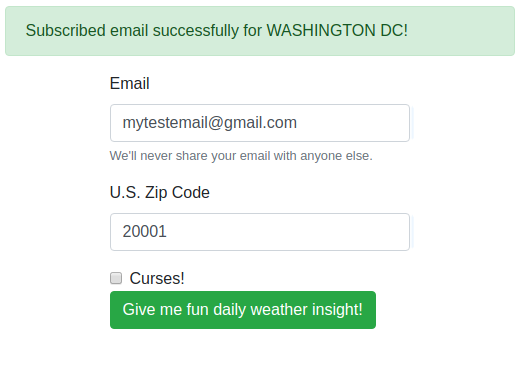
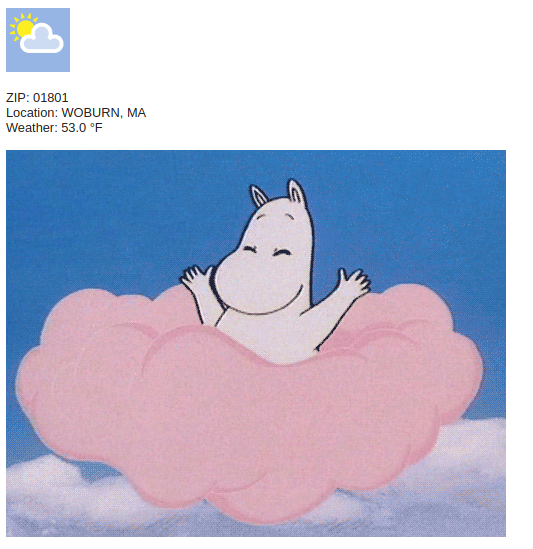

# Fweather

The name is a portmanteau of fun and weather! Pronounced fwe-ther This was made using Django, world weather online api, giphy api, gmail api, and sqlite.

TODO: heroku demo link

Subscribing an email in Washington, DC

Receiving an email for subscriber in Woburn, MA after verification.

## Requirements

* [pipenv](https://docs.pipenv.org) - setup environment vars
* [pyenv](https://github.com/pyenv/pyenv) or python 3 - cause python 2 will die soon
* [npm](https://www.npmjs.com/get-npm) - to install js / css dependencies
* Sign up for the [world weather online api](https://developer.worldweatheronline.com) to get historical weather for free for 60 days
* Sign up for the [giphy api](https://developers.giphy.com) to get gifs
* Sign up for the [gmail api]() to send emails
    * Purposely didn't use Klaviyo or MailChimp because that would make the app WAY too easy ;)
* Insert tokens in the [`.env`](https://medium.com/@thejasonfile/using-dotenv-package-to-create-environment-variables-33da4ac4ea8f) file to keep sensitive information stored as environment variables
    * `.env` is committed so do not upload a personal one by mistake. Run the command below to ignore local changes.
    * `git update-index --assume-unchanged .env`

## Quick start

### Dependencies

python 3.6

    pyenv install 3.6.5
    pyenv local 3.6.5

pip dependencies

    pipenv install

sqlite database schema

    python manage.py makemigrations fweather
    python manage.py migrate --run-syncdb

js and css

    npm i
    python manage.py collectstatic

### Run

    python manage.py runserver --noreload

Note: The `--noreload` is important as it will prevent the app from running the overriden `ready()` function twice. The app gets the gmail refresh token on django start.

In production environments, it's better to run it using `gunicorn`.

    gunicorn fweather.wsgi

It's also runable in docker if using ECS or Docker Swarm / Kubernetes to deploy.

    # build
    docker build -t fweather .
    # run daemonized
    docker run -p 8000:8000 -d fweather

## Admin panel

Register

    python manage.py createsuperuser

Login on http://localhost:8000/admin

## Management commands

    python manage.py send
        --email EMAIL         Send to a particular email
        --email-all           Send to all emails in database

## TODO

### Essential

- [x] read info from .env file
- [x] django skeleton
- [x] sign up to get giphy api
- [x] sign up to get openweathermap api
- [x] sign up page with email and ~~country~~ zip code
- [x] sign up form submittal using jquery to hit api
- [x] api checks for email that's already signed
- [x] api sanitizes input
- [x] api upserts tiny db with email and country
- [x] ui always looks like the submission works so no one can see who signed up
- [x] admin interface
- [x] foreign key constraint on email
- [x] admin interface allows editing foreign key
- [x] use the gmail api to send email
- [x] get gmail token on boot and check if the token exists already
- [x] email is sent asynchronously
- [x] use weather api to get weather for a location
- [x] verify subscriber using email and `uuid.v4()`
- [x] django management command to send out email to every person
- [x] email contains current weather from the location provided
- [x] use giphy api to get a related weather gif
- [x] email contains a gif
- [x] prompt "are you sure?" before sending email to everyone on the list
- [x] Replace `print` statements with `logging`

## Extra

- [ ] \[deploy\] heroku
    - [ ] research postgresql integration since heroku does not persist sqlite dbs
    - [x] installed whitenoise middleware to deliver static files while `debug=True`

- [ ] \[feature\] unsubscribe - would have to generate another temp id that only gets sent in emails
- [ ] \[feature\] email can be written in markdown template
- [ ] \[feature\] email contains fahrenheit and celsius
- [ ] \[feature\] email forecasts the week
- [ ] \[feature\] email is sexy using zurb
- [ ] \[feature\] curses
- [ ] \[sec\] recaptcha on subscribe
- [ ] \[sec\] encrypt email data in database and store key in file or separate database
- [ ] \[maint\] django tests
- [ ] \[doc\] sphinx autodoc

## Notes

### Security

- Zip codes and emails are validated
- Only zip codes converted to city, state are returned and printed client side
- Always returned a successful message (unless bad zip or email) in case someone is guessing at the database for who's already using my fun weather email service
- Validated emails that subscribed before sending them emails
- To increase security more, I could add a recaptcha, encrypt email data (or offload emails to mailchimp / klaviyo), and add additional security headers using securityheaders.io as a reference

### Re-inventing the wheel

- I used zipcodes and email_validator instead of recreating my own validation
- I used bootstrap to make the sign up page formatted and look more appealing

I could have...

- used MailChimp / klaviyo
    - used API to add the email addresses (less than 2000 are free) and custom text field like zip code or location
    - used API again to send the emails using the custom django manage command
    - e.g. http://eepurl.com/dsmv2P
- Used flask (soooo much easier) instead of django but then I wouldn't have learned django
- The above steps would remove the overhead of the database, input injection, PII / GPDR, styles, javascript... so much stuff

### Usability

- Sign up page is using bootstrap so everything looks OK
- Additional things to add would be a background, maybe a nice navbar at the top, a form rounded edge border

### Learned

- Django basics such as setting up a project, creating a database
- Django admin section is pretty cool
- Debugging django in pycharm

### Other

- I could not sign up for Weather Underground because they have a bug on their sign up page
- I thought if I provided a location for weather it would be too easy for users to fake their location with a simple dropdown. Instead I used zip codes.

    For convenience, here are some sample zip codes

    | Location | Zip |
    |---|---|
    | Anchorage, AK  | 99501  |
    | Austin, TX  | 73301  |
    | Boston, MA  | 02111  |
    | Seattle, WA  | 98101  |
    | Washington, DC  | 20001  |
